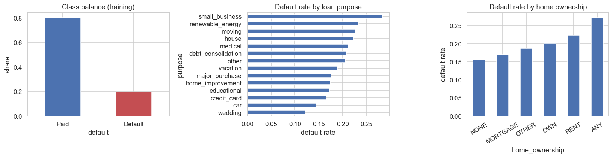
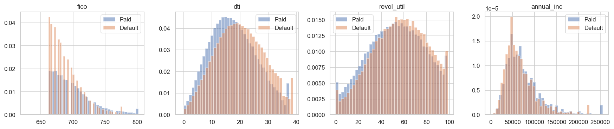
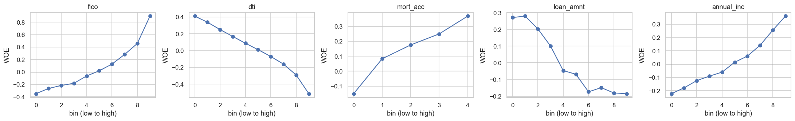
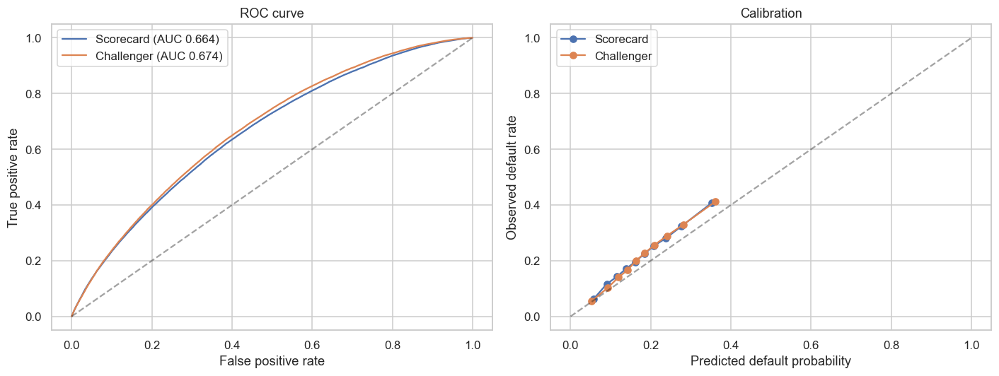
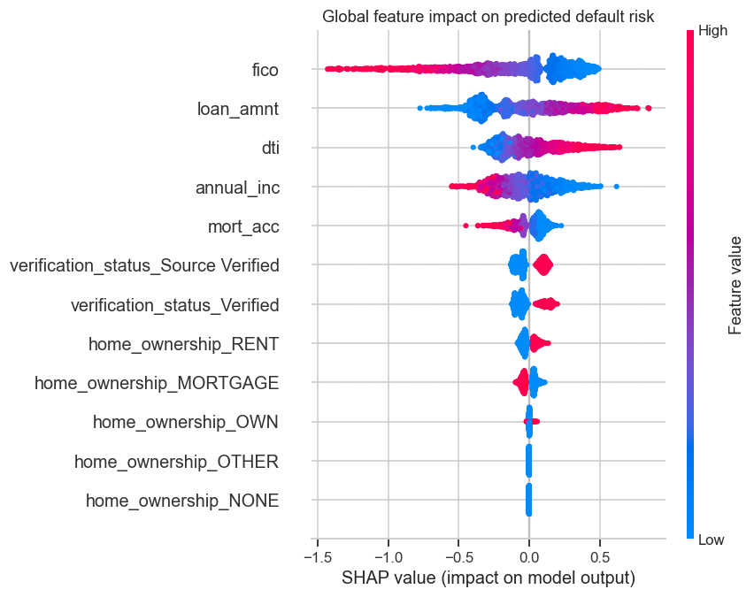
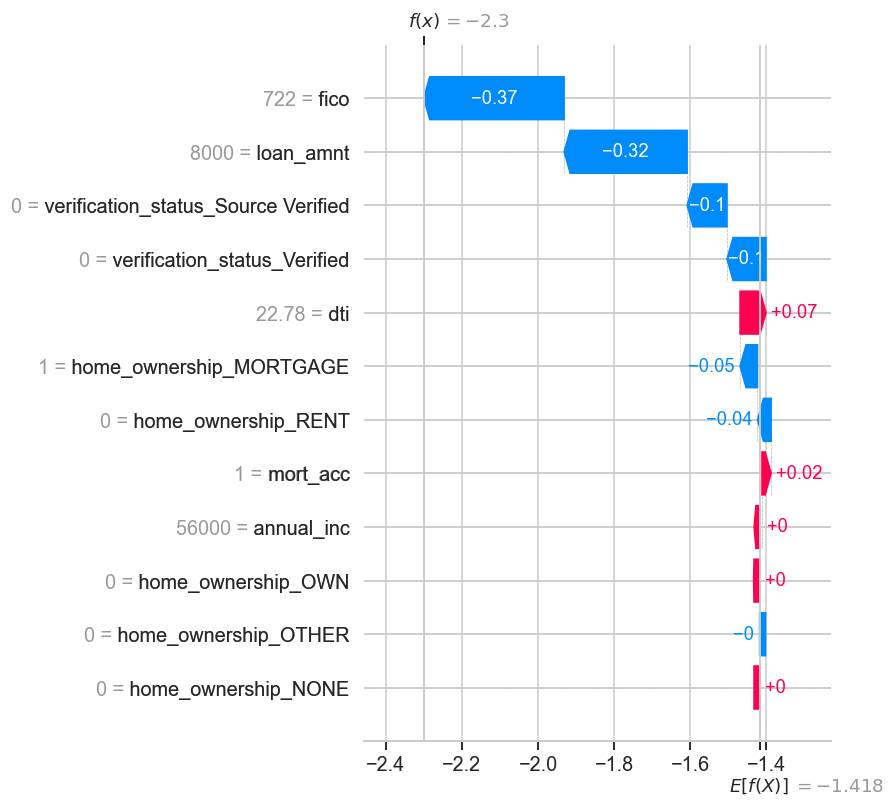
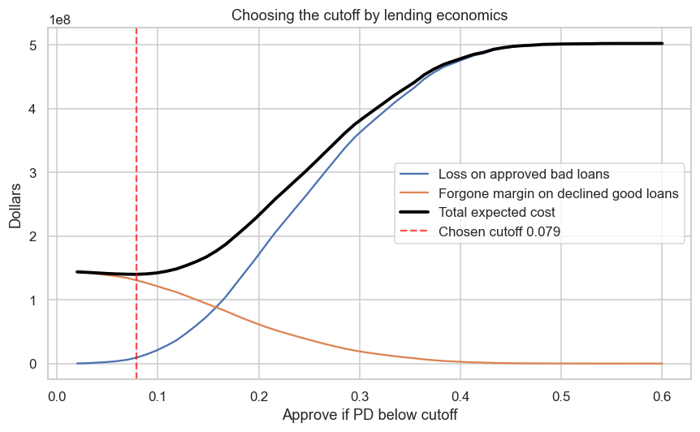
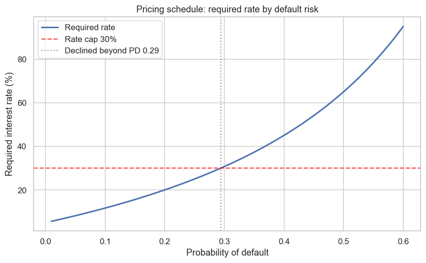
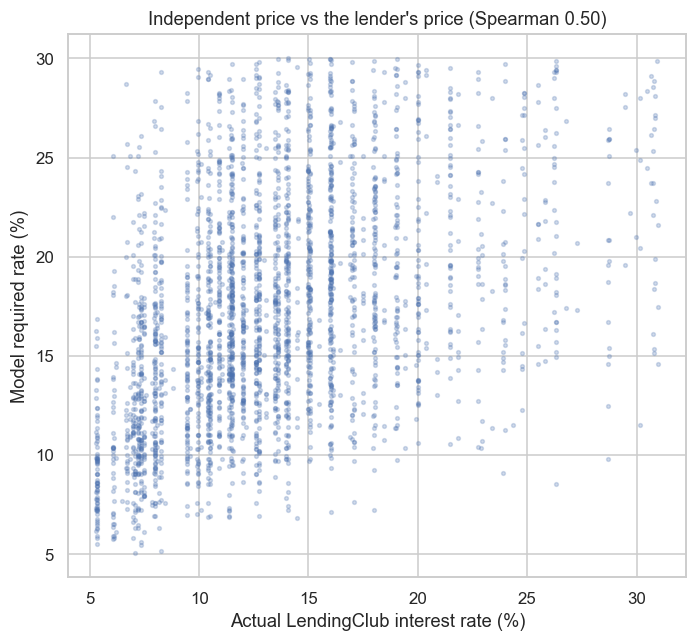

# Credit Risk Scorecard and Expected Loss Model

**Estimating whether a loan applicant will repay, then turning that estimate into a transparent score, a price, and a lending decision.**

This project builds the kind of model a bank or online lender uses to decide who gets a loan. For each application it estimates the chance the borrower will default, presents that estimate as a plain, points-based scorecard a credit officer can read, and converts it into a dollar figure and an approve, price, or decline recommendation. It is built to the standards a real lending function would expect: no cheating with information the lender would not have at decision time, an honest independent view of risk, and documentation written the way a bank's model validation team would want to see it.

## At a glance

- An application-time default model built as an interpretable scorecard, with a gradient boosting challenger to measure the accuracy given up for that transparency.
- Honest performance once the lender's own risk assessment is removed: a test-set AUC of **0.66**, deliberately modest and genuine, rather than an inflated 0.90-plus that comes from reusing the lender's grade.
- A pricing layer that lifts approvals from **10% to 88%** and expected profit roughly **15x** by charging for risk instead of only declining it.
- The model's independent prices line up with LendingClub's actual interest rates at a rank correlation of **0.50**, even though those rates were never used in training.
- A fairness review that improves the adverse-impact ratio from **0.17 to 0.87** under pricing, while being explicit about the new disparity that pricing introduces.

---

## Contents

- [The problem in plain terms](#the-problem-in-plain-terms)
- [What makes this different](#what-makes-this-different)
- [The data](#the-data)
- [How it works, step by step](#how-it-works-step-by-step)
- [Results](#results)
- [Key decisions and trade-offs](#key-decisions-and-trade-offs)
- [Limitations and model risk](#limitations-and-model-risk)
- [What I would do next](#what-i-would-do-next)
- [How to run it](#how-to-run-it)
- [Figure checklist](#figure-checklist)

---

## The problem in plain terms

Every lender faces the same tension. Approve too freely and you lose money on loans that default. Approve too cautiously and you turn away good customers and forgo the interest they would have paid. The job of a credit risk model is to sit in the middle of that trade-off: estimate, for each applicant, how likely they are to default, so the lender can make a decision that balances losses against lost business.

An estimate on its own is not enough. A lending function needs three more things, and this project delivers all three:

1. **A decision it can explain.** If an applicant is declined, they are legally entitled to a reason. A model that cannot explain itself cannot be used. So the main model here is a scorecard, a transparent points system where you can see exactly why each applicant scored the way they did.
2. **A number in dollars.** "This applicant has a 12% chance of default" only becomes useful when combined with how much would be lost if they do default. That gives an expected loss, which is what a lender actually budgets and provisions against.
3. **An action.** The model does not stop at a probability. It decides whether to approve, at what interest rate to price the risk, or whether to decline, the way a real lender operates.

---

## What makes this different

The easiest way to get an impressive looking accuracy number on this dataset is to accidentally cheat, and most public examples of this problem do exactly that. This project is deliberately built to avoid it, and that discipline is the point.

**It never uses information from the future.** Some fields in the data only exist after a loan has run its course, things like how much was eventually recovered. Using those to predict default is like predicting a football result from the final score: it looks brilliant and means nothing. This project reads only the fields that would be known at the moment of application, and enforces that at the point the data is loaded, so future information cannot slip in by accident.

**It forms its own opinion of risk.** LendingClub already assigned every loan its own grade and interest rate, its own risk judgement. It would be easy and circular to just relearn that judgement and report a high score. Instead, this project deliberately throws away LendingClub's grade, sub-grade, interest rate, and installment, and builds an independent view of borrower risk from the ground up. The cost of this honesty is a lower headline accuracy, and that is expected. Once you remove the lender's own answer, an application-only default model on this data realistically lands in the high 0.60s to low 0.70s on the main accuracy measure. That is a genuine credit result, not an inflated one.

**It is tested on the future, not a shuffle.** The model is trained on older loans and tested on newer ones, exactly the way a scorecard is used in practice: built on history, applied to tomorrow's applicants. This is harder and more honest than the usual random shuffle.

The contrast is stark. Public tutorials on this same data commonly report accuracy scores in the 0.90s. Those numbers come almost entirely from using the lender's own grade and pricing as inputs, relearning the answer, and do not reflect real predictive skill. The lower, honest numbers in this project are the ones that would survive contact with a validation team.

---

## The data

The project uses the **LendingClub public loan book**, a real record of consumer loans and how each one turned out. The raw file holds **2,260,701 loans**. The target, the thing being predicted, is whether a loan defaulted:

- A loan that was **fully paid** is treated as a good outcome (0).
- A loan that was **charged off or defaulted** is treated as a bad outcome (1).
- Loans still being repaid have no known outcome and are dropped (915,351 of them).

After keeping only resolved loans, the modelling set is **1,345,350 loans**, with an overall default rate of **20.0%**. The data is available on Kaggle at [wordsforthewise/lending-club](https://www.kaggle.com/datasets/wordsforthewise/lending-club/data), and is not included in this repository because of its size.

---

## How it works, step by step

Each step explains what it does and why, then shows a representative piece of the actual code and the result. You do not need to read the code to follow the story.

### Step 1: Load the data without cheating

Rather than reading everything and deleting the dangerous fields afterwards, the loader reads only a pre-approved list of application-time fields. Future information never enters the workspace, so it cannot leak.

```python
# Only application-time borrower attributes are ever read from the file.
CORE_FEATURES = [
    "loan_amnt", "term", "emp_length", "home_ownership", "annual_inc",
    "verification_status", "purpose", "dti", "delinq_2yrs", "earliest_cr_line",
    "fico_range_low", "fico_range_high", "inq_last_6mths", "open_acc", "pub_rec",
    "revol_bal", "revol_util", "total_acc", "mort_acc", "pub_rec_bankruptcies",
    "application_type", "addr_state",
]
# LendingClub's own risk verdict, deliberately excluded so the model is independent of it.
LC_ASSESSMENT = ["grade", "sub_grade", "int_rate", "installment"]
```

The result: 2,260,701 loans loaded, 1,345,350 kept after removing unresolved ones, and a training and test split by loan date at 2016-10-01 (1,081,337 older loans to train on, 264,013 newer loans to test on).

### Step 2: Understand what drives default

Before modelling, the training data is explored to check that the patterns match credit intuition, that risk rises and falls where a lender would expect. This is done on the training data only, so nothing about the test set influences later choices.

> **Figure 1: Where default risk concentrates.**
> 
> *Left: only about one loan in five defaults, so the classes are imbalanced. Middle and right: default rates vary meaningfully by loan purpose and home ownership status, exactly the kind of signal a credit model should pick up.*
> <sub>Source: notebook cell 11</sub>

> **Figure 2: Risk drivers separate defaulters from payers.**
> 
> *Borrowers who defaulted versus those who paid, across credit score, debt to income, credit card utilisation, and income. Clear separation, especially on credit score, confirms these fields carry real predictive signal.*
> <sub>Source: notebook cell 12</sub>

### Step 3: Turn every factor into a comparable risk signal

Different fields are measured in different units: dollars, percentages, counts. To put them on a common footing, each factor is grouped into bands and each band is recoded to its **weight of evidence**, a single number saying how much safer or riskier that band is than average. This transformation lets a simple, transparent model behave like a proper scorecard.

Alongside it, each factor gets an **information value**, a one-number summary of how much it helps separate good borrowers from bad. Weak factors are screened out. Here is the ranking from the training data:

| Factor | Information value | Kept? |
|---|---:|:---:|
| Credit score (FICO) | 0.123 | Yes |
| Debt to income ratio | 0.077 | Yes |
| Income verification status | 0.053 | Yes |
| Mortgage accounts | 0.035 | Yes |
| Loan amount | 0.032 | Yes |
| Annual income | 0.031 | Yes |
| Home ownership | 0.026 | Yes |
| 14 weaker factors | below 0.02 | No |

Seven factors clear the bar. Note how modest even the strongest is: credit score at 0.123 is only a medium strength predictor by industry rules of thumb. That is the honest consequence of the earlier decision to exclude the lender's own grade and pricing, which would otherwise have dominated. The model is built entirely on genuinely independent, and therefore genuinely weak, signals.

A quality check then confirms each numeric factor behaves sensibly. Risk should move in one consistent direction as a factor changes, so each is plotted across its bands. Four of the five held numeric factors are monotonic. Loan amount came back non-monotonic, which is exactly what the check is meant to catch, and it is flagged here as a candidate for re-binning or removal in a production build rather than quietly kept.

> **Figure 3: Sanity checking the risk signals.**
> 
> *Each numeric factor's risk signal plotted across its bands. A steady slope means the factor moves the way credit sense says it should. The check flagged loan amount as an exception, worth revisiting before deployment.*
> <sub>Source: notebook cell 17</sub>

### Step 4: Build the scorecard

The main model is a **logistic regression**, a simple, well understood method, fit on the weight of evidence signals. Because the inputs share a common scale and the model is linear, every factor's contribution is fully visible. The fitted model is then scaled into **points**, using the standard formulation lenders use, so the result reads like a familiar credit scorecard: a higher score means a safer applicant.

```python
# Point allocation the scorecard assigns for credit score.
# Points rise smoothly with score, so a safer applicant scores higher, exactly as intended.
#   FICO band            points
#   up to 667              66
#   667 to 672             68
#   ...                    ...
#   737 and above          99
```

The scorecard reaches a test-set AUC of **0.664**.

### Step 5: Train a challenger to measure the ceiling

A more powerful, flexible model, **XGBoost**, is trained on the same information as a challenger. Its job is to answer one question: how much accuracy is given up by keeping the deployed model simple and explainable? Because this kind of model produces distorted probabilities out of the box, it is calibrated so its scores can be read as honest default probabilities. The challenger reaches a test-set AUC of **0.674**, about one point above the scorecard.

### Step 6: Judge the models honestly

The models are compared on how well they rank risk and how honest their probabilities are, not on raw accuracy, which is misleading when only one loan in five defaults. Four measures, in plain terms:

- **AUC**: pick a random defaulter and a random payer; how often does the model rank the defaulter as riskier? 0.5 is a coin flip, 1.0 is perfect.
- **Gini**: the same information as AUC on a different scale.
- **KS**: the widest gap between where good and bad borrowers pile up on the score. Bigger means cleaner separation.
- **Brier**: are the probabilities honest? A group the model calls 20% risk should default about 20% of the time. Lower is better.

| Model | AUC | Gini | KS | Brier |
|---|---:|---:|---:|---:|
| Scorecard (logistic regression) | 0.664 | 0.328 | 0.235 | 0.1620 |
| XGBoost challenger (calibrated) | 0.674 | 0.348 | 0.250 | 0.1609 |

> **Figure 4: Ranking power and probability honesty.**
> 
> *Left (ROC curve): both models rank risk clearly better than chance, with the challenger slightly ahead. Right (calibration): predicted default rates track observed default rates closely, so the probabilities can be trusted, not just ranked.*
> <sub>Source: notebook cell 25</sub>

### Step 7: Explain the decisions

In lending, a model has to justify itself, to the applicant and to a regulator. **SHAP** attributes every prediction back to the factors that drove it, both across all applicants and for any single person. This is what makes even the more complex challenger defensible: its behaviour can be shown to agree with credit sense.

> **Figure 5: What drives risk across all applicants.**
> 
> *Each factor's influence on predicted risk, ranked. The pattern matches intuition, with credit score, debt load, and income doing the heavy lifting, which is what lets a flexible model be trusted in a regulated setting.*
> <sub>Source: notebook cell 28</sub>

> **Figure 6: Why one specific applicant scored as they did.**
> 
> *A single applicant's prediction broken down factor by factor, showing which attributes pushed their risk up or down. This is the raw material for an explainable adverse action reason.*
> <sub>Source: notebook cell 29</sub>

### Step 8: Turn risk into dollars and a baseline decision

A probability becomes a business input once it is multiplied by how much would be lost on a default and how large the loan is. That gives **expected loss**. Across the test book, total expected loss is about **$429M**. From there, a baseline approve or decline cutoff is chosen by economics rather than a statistical rule: approving a loan that defaults costs the loss on it, while declining a good applicant costs the margin they would have paid. The cutoff that minimises total expected cost is selected.

That cutoff sits at a default probability below **0.079**, approving only about **10%** of applicants (27,241 of 264,013). It accepts roughly **$9.3M** of expected loss from bad loans that pass, and forgoes about **$130.6M** of margin from good loans it declines.

> **Figure 7: Choosing the cutoff by economics, not statistics.**
> 
> *As the approval bar moves, the cost of approving bad loans trades off against the cost of turning away good ones. The chosen cutoff sits at the bottom of the combined cost curve.*
> <sub>Source: notebook cell 32</sub>

This baseline exposes a real tension. On a population that defaults at 20%, a pure approve or decline rule, with no ability to charge more for more risk, is forced to reject most applicants to stay profitable. That is not how real lenders behave, which leads to the final and most important step.

### Step 9: Price the risk, the way a real lender does

A real lender rarely just declines a risky applicant. It charges them a higher interest rate so the loan is still expected to be profitable, and declines only when the risk cannot be priced within the rate it is allowed to offer. This step turns each applicant's default probability into the minimum interest rate that would make the loan hit a target return, approves and prices everyone who can be priced under a rate cap, and declines the rest.

```python
def required_rate(pd_hat, lgd=0.55, funding=0.03, target=0.02):
    """Minimum rate that makes a loan hit its target return, given its default risk.
    Higher risk loans must charge more, because interest is only collected from the
    borrowers who do not default."""
    return (target + funding + pd_hat * lgd) / (1 - pd_hat)
```

> **Figure 8: The pricing schedule.**
> 
> *The interest rate the model would charge rises with default risk. Beyond the point where the required rate crosses the cap, the risk cannot be priced profitably and the applicant is declined.*
> <sub>Source: notebook cell 35</sub>

Pricing changes the economics sharply. Instead of declining most of the book, the lender can now serve the large majority of applicants, each priced to their risk:

- Baseline approve or decline: approves **10.3%** of applicants.
- Pricing: approves **87.9%** of applicants, at an average rate of **17.0%**, declining only the small tail whose risk cannot be priced under the 30% cap.
- Expected portfolio profit rises from about **$4.2M** under the baseline to about **$62.3M** under pricing, roughly fifteen times more, simply by serving far more borrowers at a positive expected margin.

**Does the model actually price risk well?** This is the strongest evidence in the project. The model built its prices with no knowledge of what LendingClub actually charged, because the lender's real interest rates were excluded from the entire modelling process. Loading those real rates only now, purely for comparison, the model's independently derived prices line up with LendingClub's actual pricing at a rank correlation of **0.50** (Spearman). A model that never saw the lender's answer arrives at broadly the same risk ordering the lender used. Given that the model relies on only seven independent and deliberately weak factors, a moderate positive correlation here is meaningful external evidence that the risk ranking is sound, despite the modest headline accuracy.

> **Figure 9: Independent prices versus the lender's real prices.**
> 
> *Each point is a loan: the model's required rate against LendingClub's actual rate. The upward trend, produced without ever using the lender's rates in training, is external evidence the model's risk ranking is trustworthy.*
> <sub>Source: notebook cell 37</sub>

### Step 10: Check for fairness

Lending decisions are tested for disparate impact, where a neutral looking rule produces unequal outcomes across groups. This public data contains no protected attributes such as race or gender, so a true fair lending test is not possible. Instead the project demonstrates the method across an available proxy, income bands, and is explicit about the limitation. It checks both levers:

- **Who gets approved.** Under the baseline cutoff, approvals skew heavily toward higher earners, an adverse-impact ratio of **0.17**, well below the 0.80 four-fifths benchmark. Pricing improves this to **0.87**, because it prices lower income applicants rather than declining them outright.
- **What rate they are charged.** Pricing moves the disparity from approval into the rate offered. The lowest income band is charged about **19%** on average against about **15%** for the highest, because lower income correlates with higher default risk. Charging groups that correlate with protected classes higher rates is itself a fair lending concern, so the project surfaces this trade-off honestly rather than treating pricing as a clean fix.

---

## Results

All figures on the time-based holdout, the newer loans the model never trained on.

| Model | AUC | Gini | KS | Brier |
|---|---:|---:|---:|---:|
| **Scorecard** (logistic regression, deployed) | 0.664 | 0.328 | 0.235 | 0.1620 |
| **XGBoost challenger** (calibrated) | 0.674 | 0.348 | 0.250 | 0.1609 |

The challenger's advantage over the transparent scorecard is small, about one point of AUC. That narrow gap is exactly the argument for deploying the scorecard: it gives up almost nothing in accuracy and gains full explainability, which a lending decision requires.

**Decision layer, on the test book:**

| | Baseline cutoff | Risk-based pricing |
|---|---:|---:|
| Applicants approved | 10.3% | 87.9% |
| Average rate charged | flat margin | 17.0% |
| Expected portfolio profit | ~$4.2M | ~$62.3M |
| Adverse-impact ratio (income proxy) | 0.17 | 0.87 |

Independent validation: the model's prices correlate with LendingClub's actual interest rates at a rank correlation of 0.50, despite those rates never being used in training.

---

## Key decisions and trade-offs

Every important choice traded a bigger headline number for a more defensible model. That is deliberate.

- **Excluding the lender's own grade and pricing** cost a lot of apparent accuracy but bought an independent, non-circular view of risk, and made the external validation in Step 9 possible.
- **Reading only application-time fields** removed the most common source of inflated results on this dataset, at the price of a lower ceiling.
- **Testing on the future rather than a random shuffle** is harder to score well on, but it is the only test that reflects how a scorecard is actually deployed.
- **Deploying the simple scorecard over the more accurate challenger** gives up about one point of AUC for full explainability, the right call when decisions must be justified.
- **Adding a pricing layer** turned an unrealistically conservative approve or decline rule into a realistic lending policy, lifting approvals from 10% to 88% and profit roughly fifteen fold, and resolved the tension the baseline exposed.

---

## Limitations and model risk

This section is written in the spirit of a model validation document, stating honestly where the model should not be trusted.

- **Loss and exposure are assumed, not modelled.** How much is lost on a default, and the borrower's exposure, are set with stated assumptions because the public data lacks recovery detail. The pricing also assumes a cost of funds, a target return, and a rate cap. A production model would estimate these directly.
- **Selection bias.** The model is trained only on accepted loans, a non-random sample of everyone who applied. Applicants the lender declined never appear and have no recorded outcome, so the model can be miscalibrated on the true through-the-door population. The standard remedy, reject inference, is not attempted here because the public rejected-applications file has no outcome to infer from; the limitation is stated instead.
- **One lender, one window.** The data is a single lender's population over a fixed historical period, so the model may not generalise to other lenders or economic conditions.
- **No protected attributes.** A genuine fair lending assessment is not possible on this data; the fairness section demonstrates method and mindset on a proxy only.
- **Take-up is assumed.** The pricing analysis assumes applicants accept the offered rate, with no modelling of take-up or adverse selection.
- **One feature is non-monotonic.** The monotonicity check flagged loan amount, which a production build would re-bin or drop.

In production the model would be monitored for population drift using the population stability index, checked periodically against realised default rates, and recalibrated or rebuilt when either drifts materially.

---

## What I would do next

- Model loss given default and exposure directly instead of assuming them, to sharpen the expected loss and pricing figures.
- Add a take-up model to the pricing layer, so approval and profit reflect that some priced offers would be declined by the borrower.
- Re-bin or drop the non-monotonic factor and re-fit, to tighten the scorecard.
- Extend the fairness work with formal pricing disparity testing if proxy or protected attributes become available.
- Stress test the model across economic conditions rather than a single historical window.

---

## How to run it

Install the dependencies:

```
pip install pandas numpy matplotlib seaborn scikit-learn xgboost shap
```

Download the LendingClub accepted-loans file from Kaggle (search "wordsforthewise Lending Club"). Then either set the path in the notebook's configuration cell, or point an environment variable at it:

```
export LENDINGCLUB_ACCEPTED="/path/to/accepted_2007_to_2018Q4.csv"
```

Open **`Credit-Risk-Scorecard-Model.ipynb`** and run it top to bottom. Each cell handles one logical step, with the reasoning explained alongside.

**Repository structure**

- `Credit-Risk-Scorecard-Model.ipynb`: the full analysis, one step per cell.
- `README.md`: this document.
- `requirements.txt`: dependencies.
- `images/`: figures referenced in this README (see checklist below).

---

## Figure checklist

Create an `images/` folder and save each plot from the notebook under the filename below.

| File | What it shows | Notebook cell |
|---|---|---|
| `fig1_eda_overview.png` | Class balance, default by purpose, default by home ownership | 11 |
| `fig2_risk_drivers.png` | Score, DTI, utilisation, income distributions by outcome | 12 |
| `fig3_woe_monotonicity.png` | Weight of evidence by band, monotonicity check | 17 |
| `fig4_roc_calibration.png` | ROC curve and calibration curve | 25 |
| `fig5_shap_beeswarm.png` | Global SHAP feature impact | 28 |
| `fig6_shap_waterfall.png` | Single applicant SHAP explanation | 29 |
| `fig7_cost_curve.png` | Cost curve for choosing the cutoff | 32 |
| `fig8_pricing_schedule.png` | Pricing schedule, required rate by risk | 35 |
| `fig9_price_validation.png` | Model price versus actual LendingClub rate | 37 |

---

## Author

**Jianyu Jia**
