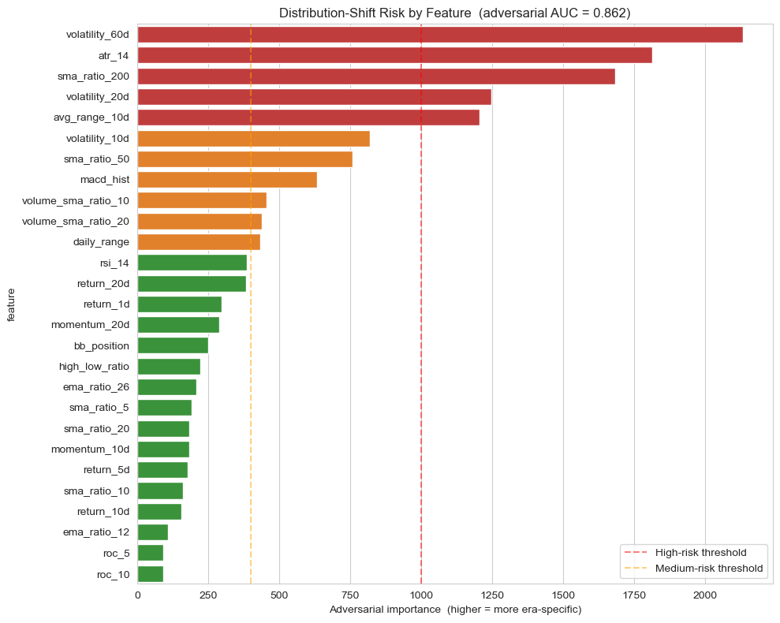
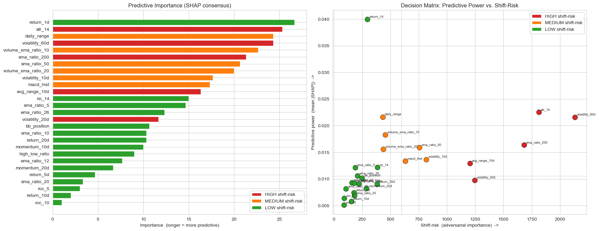
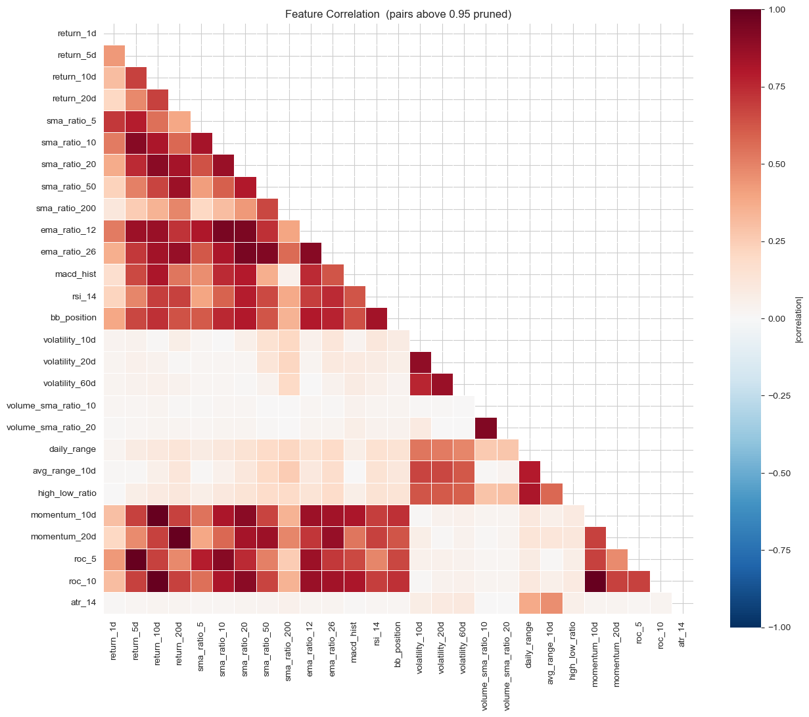
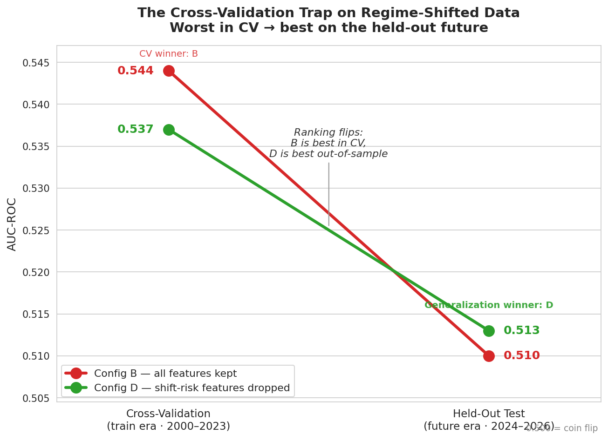

# Predicting Next-Day Stock Direction Under Market Regime Shift

**Predicting whether a stock closes higher or lower the next trading day, and using the discipline a faint signal demands to build a model that holds up on a market it was never trained on.**

This project tackles one of the hardest settings for machine learning: forecasting the direction of a stock one day ahead. The signal is faint by nature, so the work is less about accuracy and more about honesty. Training data covers 2000 to 2023 and test data covers 2024 to 2026, two genuinely different market eras, so a model that memorizes the past has little chance of transferring to the future. The whole project is organized around that fact, and around the discipline it forces: measure the shift before modeling it, separate features that predict from features that merely look stable, and trust held-out performance over cross-validation when the two disagree.

## At a glance

- A next-day direction model across 100 anonymized US equities, built as a case study in finding real signal in noisy data without fooling yourself.
- Training (2000 to 2023) and testing (2024 to 2026) come from different market regimes, so the real challenge is generalization, not accuracy.
- Adversarial validation confirms the shift at an AUC of about **0.86**: a simple model can tell which era a single day came from with high confidence.
- A held-out AUC of **0.515** on a task where 0.500 is a coin flip and 0.520 is a meaningful trading edge.
- The headline finding: the feature set with the **worst** cross-validation score generalized the **best** on the held-out future.
- Every gain came from making the model simpler or more robust, never more complex.

---

## Contents

- [The problem in plain terms](#the-problem-in-plain-terms)
- [What makes this different](#what-makes-this-different)
- [The data](#the-data)
- [How it works, step by step](#how-it-works-step-by-step)
- [Results](#results)
- [Key decisions and trade-offs](#key-decisions-and-trade-offs)
- [Limitations and model risk](#limitations-and-model-risk)
- [What I would do next](#what-i-would-do-next)
- [How to run it](#how-to-run-it)
- [Figure checklist](#figure-checklist)

---

## The problem in plain terms

Financial markets are close to efficient, so the direction of a stock tomorrow is close to unpredictable. On this task an AUC of 0.500 is a coin flip, and even 0.520 counts as a meaningful edge in real trading. That sets the goal. The aim is not an accurate model in any everyday sense. It is a model that ranks up-days slightly above down-days, consistently, on data it has never seen, because even a tiny reliable edge compounds at scale.

There is a second, harder problem layered on top. The training window contains the dot-com collapse, the 2008 crisis, and the COVID crash. The test window is the post-pandemic recovery, a rate-cut cycle, and the AI-driven rally. These are not the same market. A model that learns what worked in the training era has no guarantee of transferring to the test era. So this is a distribution-shift problem as much as a prediction problem, and treating it that way is the point of the whole analysis.

## What makes this different

The easy path on a task like this is to chase the best cross-validation score and quietly overfit the training era. This project takes the opposite stance. It treats generalization to the unseen future as the only goal that matters, and it is willing to accept a lower cross-validation score to get there.

**It measures the shift before modeling it.** Rather than worrying vaguely about regime change, the project quantifies it. Adversarial validation turns the concern into a single number and a ranked list of the features responsible.

**It separates predictive from stable.** A feature that helps in the training era can be useless in the test era. The project ranks features two ways at once, by how much they help prediction and by how much they carry era-specific information, and keeps only the ones that score well on both.

**It distrusts cross-validation on purpose.** When train and test come from different worlds, cross-validation rewards fitting the training era and flatters exactly the features that will not transfer. The clearest evidence is the headline result: the configuration that scored worst in cross-validation scored best on the held-out future.

**It ensembles for difference, not quantity.** Three gradient-boosted tree models, blended together, lost to a single one, because they make the same mistakes. The winning combination pairs one strong model with one deliberately simple and structurally different model that cannot overfit the same way.

## The data

The project uses a public competition dataset of 27 engineered technical indicators for 100 anonymized US equities. There are no raw prices, tickers, or dates, only computed signals, which keeps the focus on modeling rather than on identifying the underlying names.

- The target is next-day direction: 1 if the stock closes higher the next trading day, 0 if lower.
- Training covers 2000 to 2023 (440,402 rows). Testing covers 2024 to 2026 (53,276 rows).
- The classes are nearly balanced, about 50.3% up-days in training and 51.6% in test, so no resampling is needed.

One consequence of the anonymization matters later. Because no dates are provided, there is no way to split the training data by time, so cross-validation has to shuffle rows rather than respect chronological order. The data is available on Kaggle and is not included here because of its size.

## How it works, step by step

Each step explains what it does and why, then points to the figure or result it produces. You do not need to read the code to follow the story.

### Step 1: Load and shrink the data

Left as 64-bit floats, the training and test tables together take about 140 MB, which is wasteful once several cross-validation folds and models are held in memory at once. Two cheap conversions roughly halve the footprint with no meaningful loss of precision. The indicator columns are stored as 32-bit floats, and the stock identifier "stock_030" is stored as the single byte 30. The full pipeline then fits comfortably in a 16 GB kernel.

### Step 2: Measure the regime shift

Before building anything predictive, the project measures the problem it suspects. Adversarial validation forgets the real target, labels every training row 0 and every test row 1, and trains a classifier to tell the two apart.

```python
# Forget the real target. Label where each row came from, then try to separate them.
a_train["is_test"] = 0
a_test["is_test"]  = 1
# A high AUC here means the two eras are easy to tell apart, i.e. a large distribution shift.
```

The AUC of that classifier is a direct measure of the shift. It comes back at about 0.86, nowhere near the 0.50 that would mean the eras look alike. In plain terms, a simple model can look at one day of indicators and guess which era it came from with high confidence. The feature importances from this step become a shift-risk score carried through the rest of the project.

> **Figure 1: Which features give the era away.**
> 
> *Each feature's shift-risk, measured by how much the adversarial model leans on it. The high-risk features (red) are the long-horizon volatility and trend measures, which naturally sit at different levels across a 20-year span. The low-risk features (green) are the short-horizon returns: a 1% down-day looks the same in 2005 or 2025.*
> <sub>Source: notebook cell 15</sub>

### Step 3: Rank features by predictive power

To decide which features genuinely help predict direction, the project needs an importance measure that is honest about redundancy. Built-in tree importances tend to over-credit correlated features. SHAP values estimate each feature's true marginal contribution instead. To avoid trusting any one algorithm's quirks, SHAP is computed across three gradient-boosting libraries (CatBoost, XGBoost, and LightGBM) and averaged into a consensus ranking.

That ranking is then placed against the shift-risk score from Step 2. SHAP answers whether a feature helps, and adversarial validation answers whether it will still help later. The features worth keeping score well on both. The single most predictive feature, the one-day return, is also low shift-risk, which is exactly the combination the project is looking for. The dangerous features are the ones a model happily leans on in cross-validation but which encode the era information that will not transfer.

> **Figure 2: Predictive power against shift-risk.**
> 
> *Left: the consensus SHAP importance of each feature, colored by its shift-risk tier. Right: the decision matrix, plotting predictive power against shift-risk. The most valuable features sit top-left, predictive and stable at the same time. The top-right features are tempting in cross-validation but dangerous out-of-sample.*
> <sub>Source: notebook cell 21</sub>

### Step 4: Remove redundant features

Several of the indicators are near-duplicates, different arithmetic over the same price series. Keeping both members of such a pair adds no information and doubles the model's exposure to that one signal. The rule here is mechanical: compute the absolute correlation between every pair, and for any pair above 0.95, drop the one with the weaker predictive rank. A few features that all three models agree contribute almost nothing are dropped as well.

> **Figure 3: Where the redundancy lives.**
> 
> *The absolute correlation between features. The bright off-diagonal blocks are the near-duplicate families, and each pair above 0.95 is pruned down to its more useful member.*
> <sub>Source: notebook cell 23</sub>

### Step 5: Normalize within each stock

One indicator value can mean very different things for different stocks. A 2% daily move is a major event for a sleepy utility and an unremarkable day for a volatile growth name. Each feature is therefore z-scored within each stock, so a value of +2.5 means "unusually high for this particular stock" regardless of which stock it is, and the model can learn one clean rule instead of a hundred.

The important discipline is avoiding leakage. The per-stock mean and standard deviation are computed on the training data only and then applied to both train and test. Fitting these statistics on the test set would let information about the 2024 to 2026 period bleed into the features.

```python
# Statistics are learned on TRAIN ONLY, then applied to both frames,
# so no information about the test period leaks into the transform.
stats = train_df.groupby(stock_col)[features].agg(["mean", "std"])
```

### Step 6: Test what actually helps

Two claims now need testing rather than assuming: that per-stock normalization helps, and that dropping the shift-prone features improves generalization even if it costs cross-validation score. An ablation isolates each factor, and the result is the most important finding in the project.

Cross-validation prefers keeping every feature. The held-out test set tells the opposite story:

| Configuration | Cross-validation AUC | Held-out AUC |
|---|---:|---:|
| Config B: all features kept | ~0.544 | 0.510 |
| Config D: shift-risk features dropped | ~0.537 | **0.513** |

The configuration that scored worst in cross-validation generalized the best. This follows directly from the regime shift measured in Step 2. Cross-validation rewards fitting the training era, the shift-prone features let the model do exactly that, and that flatters the cross-validation score while hurting the future. Removing them trades in-sample score for out-of-sample robustness. From here on, the feature set is Config D.

> **Figure 4: The cross-validation trap.**
> 
> *The same two configurations, scored on cross-validation and on the held-out future. Config B wins on cross-validation but loses out-of-sample. Config D, with the shift-prone features removed, does the reverse. On regime-shifted data the ranking inverts.*
> <sub>Source: generated from the ablation results, notebook cells 28 to 29</sub>

### Step 7: Build the ensemble

An early experiment blended CatBoost, XGBoost, and LightGBM and lost to a single LightGBM, because those three are all gradient-boosted trees and make similar mistakes. Averaging models that err in the same direction buys almost nothing. Useful ensembling needs models that are wrong differently, so the final blend spans four model families: a gradient-boosted tree (LightGBM) for raw strength, an L1 logistic regression that can only see stable linear structure, a Gaussian Naive Bayes whose independence assumption means it structurally cannot overfit the joint noise a tree will, and a small neural network for smooth non-linear structure unlike a tree's axis-aligned splits.

Everything runs inside one stratified five-fold loop, producing out-of-fold predictions for honest evaluation. The combination that won on the leaderboard is the simplest pairing of the two most complementary of these: LightGBM regularized by Naive Bayes.

### Step 8: Generate submissions

Because cross-validation and held-out performance diverge on this data, the honest move is to prepare more than one candidate and let the leaderboard adjudicate, rather than trusting the best cross-validation score. Each submission is clipped to a valid probability range and checked for the correct row count before it is written.

---

## Results

All figures below are on the held-out test set, the 2024 to 2026 window the model never trained on.

| Approach | Held-out AUC | What it taught |
|---|---:|---|
| Three-tree ensemble (all features) | 0.511 | Similar models make similar errors, so there is no diversity benefit |
| All features, z-scored | 0.510 | Shift-prone features flatter cross-validation but hurt the future |
| Shift-risk features dropped | 0.513 | Lower cross-validation can mean better generalization |
| LightGBM + Naive Bayes blend | **0.515** | A deliberately different model regularizes a strong one |

For a task where 0.500 is random and 0.520 is a real edge, 0.515 on a genuinely out-of-sample, regime-shifted test set is a solid result. The final score matters less than the pattern behind it. Every gain came from making the system simpler or more robust, never more complex.

## Key decisions and trade-offs

Every important choice traded a bigger cross-validation number for a more defensible model.

- **Optimizing for the held-out future over cross-validation.** On regime-shifted data the two disagree, and cross-validation is the less trustworthy of the two.
- **Dropping shift-prone features even though it lowered cross-validation.** It cost in-sample score and bought out-of-sample robustness, which is the trade that matters here.
- **Choosing diversity over quantity in the ensemble.** One strong model paired with one deliberately simple one beat three similar models that made the same errors.
- **Preferring the simplest change that improved robustness.** Every accepted change made the system smaller or steadier, not more elaborate.

## Limitations and model risk

Stated honestly, in the spirit of a model validation note.

- **The signal is faint and the margins are small.** The edge is real but tiny, and the differences between approaches are a few thousandths of AUC. Conclusions rest on small held-out gaps and should be read that way.
- **Cross-validation cannot respect time.** The data has no dates, so a chronological split within training is impossible and the folds shuffle rows. This is one reason cross-validation is treated as an optimistic guide here rather than the final word.
- **The diversity result rests on a thin margin.** On out-of-fold data the LightGBM and Naive Bayes blend is actually a shade below LightGBM alone. The advantage shows up only on the held-out leaderboard, where it moves the score from 0.513 to 0.515.
- **One dataset, one regime.** The results come from a single competition dataset over two fixed windows and may not transfer to other assets or market conditions.
- **No trading costs.** A 0.515 AUC is a ranking result, not a strategy. Transaction costs and slippage would erode a naive implementation and are not modeled.
- **Held-out numbers come from the competition leaderboard.** They cannot be reproduced by re-running the notebook alone, which is why several candidate submissions are prepared rather than one.

## What I would do next

- Add a proper stacking layer trained with leak-free nested cross-validation.
- Model per-stock base rates explicitly rather than relying on the per-stock normalization alone.
- Try a time-decay weighting that leans on more recent training data, in case any temporal structure survives the row shuffling.
- Backtest with transaction costs to see whether the ranking edge survives as an actual strategy.
- Run the same pipeline on other asset universes and time windows to test how far the approach generalizes.

## How to run it

Install the dependencies:

```
pip install numpy pandas matplotlib seaborn scikit-learn catboost xgboost lightgbm shap
```

Place `train.csv`, `test.csv`, and `sample_submission.csv` in a `data/` folder next to the notebook. The configuration cell already points there. Then open **`stock_direction_prediction.ipynb`** and run it top to bottom. The notebook is a linear narrative with the reasoning explained alongside each step. On a GPU kernel the full run takes about 15 to 25 minutes and writes three candidate submission files.

The notebook defaults to CPU for portability. On a machine with a CUDA GPU, set CatBoost `"task_type": "GPU"` and XGBoost `"device": "cuda"` in the configuration cell for a substantial speedup.

**Repository structure**

- `stock_direction_prediction.ipynb`: the full analysis, one step per section.
- `README.md`: this document.
- `images/`: the figures referenced above (see checklist below).

## Figure checklist

The four figures used above are already saved in `images/` under the names below. Cell numbers count every cell from the top of the notebook, and each is anchored to its section so it is easy to locate. Figures 1 to 3 are direct outputs of the notebook. Figure 4 is a chart of the ablation results table.

| File | What it shows | Notebook cell |
|---|---|---|
| `fig1_shift_risk.png` | Distribution-shift risk by feature, from adversarial validation | cell 15 (Measure the regime shift) |
| `fig2_decision_matrix.png` | SHAP consensus importance, and the decision matrix of predictive power against shift-risk | cell 21 (Rank features by predictive power) |
| `fig3_correlation.png` | Feature correlation heatmap, with near-duplicate pairs pruned | cell 23 (Remove redundant features) |
| `fig4_ablation_flip.png` | Cross-validation against held-out AUC, showing the ranking flip | from the ablation results, cells 28 to 29 |

---

*Python · scikit-learn · CatBoost · XGBoost · LightGBM · SHAP*

## Author

**Jianyu Jia**
